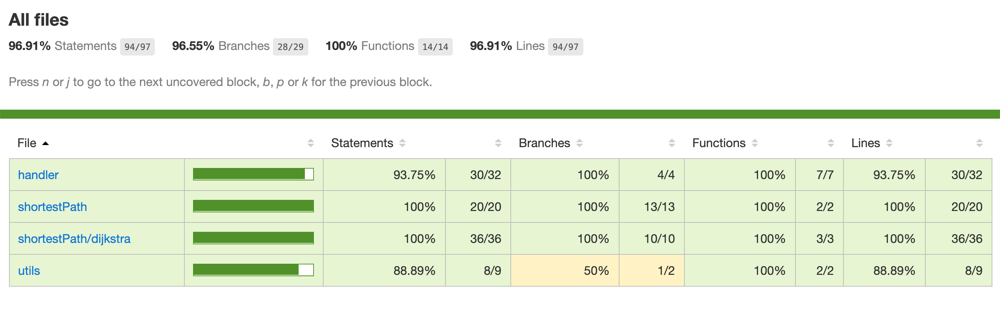

# SanAndreas Problem
  
## Introdução

Este projeto tem como objetivo implementear um programa para resolver o Problema do Correio de San Andreas, que consiste em achar o menor caminho de entrega para um pacote que trafega de uma cidade a outra.
Para resolver o problema foi utilizada a linguagem de programação `JavaScript` e os seguintes módulos foram implementados:
- Dijkstra: um algoritmo com o objetivo de achar o caminho de menor custo entre dois nós de um grafo;
- Handlers: manipuladores de arquivos, para exportar deles as informações da disposição das cidades e as rotas das encomendas;
- Utils: alguns algoritmos úteis para manipulação de arquivos.
  
## Execução
Como o programa utiliza JavaScript é preciso utilizar um Gerenciador de Pacotes para rodá-lo.
Podendo ser NPM ou YARN:
  
#### Instalar dependências:
```bash
yarn install
# OR
npm install
```
  
#### Rodar a aplicação:
```bash
yarn run start
# OR
npm run start
```
  
#### Rodar os testes:
```bash
yarn run test
# OR
npm run test
```
  
## Testes
Foram implementados testes unitários na aplicação, utilizando a biblioteca de tetes `Jest`, com o objetivo de cobrir os _edge cases_ que podem ocorrer durante o seu funcionamento.

### Cobertura de código (Code Coverage)
A seguinte imagem demonstra a cobertura de código dos testes, ou seja, a porcentagem do código que é executada quando os testes são rodados.
  

  
Para abrir esses resultados e fazer sua conferência é preciso rodar os testes, de acordo com os comandos de execução acima, logo que eles terminarem uma pasta chamada `coverage` é criada na raiz da aplicação, dentro dela estara um arquivo chamado `index.html`, abra ele no seu navegador (arrastando o arquivo para uma janela, ou digitando seu caminho no browser).
  